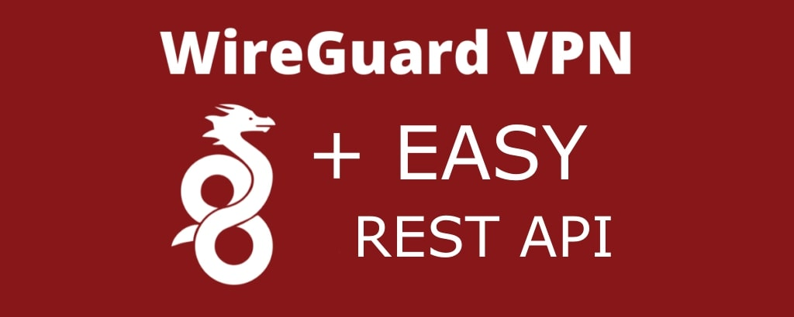

# WireGuard Easy REST API




## Features

* REST API for manage WireGuard server
* Easy installation, simple to use.
* List, create, edit, delete, enable & disable clients.
* Statistics for which clients are connected
* Good test coverage

## Requirements

* A host with a kernel that supports WireGuard (all modern kernels).
* A host with Docker installed.

### 1. Install Docker

If you haven't installed Docker yet, install it by running:

```bash
curl -sSL https://get.docker.com | sh
sudo usermod -aG docker $(whoami)
exit
```

### 2. Build an image from a Dockerfile

clone this repository and build the image from the dockerfile:

```bash
git clone https://github.com/leonovk/wg-rest-api.git
```

```bash
cd wg-rest-api
```

```bash
docker build . -t wg-rest-api
```

To run just run the command:

```
docker run -d \
-e WG_HOST=<🚨YOUR_SERVER_IP> \
-e AUTH_TOKEN=<🚨YOUR_ADMIN_API_TOKEN> \
-e ENVIRONMENT=production
-v ~/.wg-rest:/etc/wireguard \
-p 51820:51820/udp \
-p 3000:3000 \
--cap-add=NET_ADMIN \
--restart unless-stopped \
wg-rest-api
```

**If you can't start the container, try entering the command in one line**

### 3. Functionality check

Make a request to the `healthz` care api point in any way convenient for you. For example:

```bash
curl http://YOUR_SERVER_IP:3000/healthz
```

If you received something similar in response, then everything is fine.

```json
{
  "status": "ok",
  "version": "1.4.11"
}
```

### Also important

By default, the application runs in single-threaded mode. This is not a solution for heavy loads. You can change this behavior by setting the appropriate environment variables "PUMA_THREADS" and "WORKERS". However, we do not recommend doing this. The application is not thread safe. If you need large loads, it is better to raise several application instances and set up load balancing between them.

## API

All requests are authorized using the bearer token that you specified in variable AUTH_TOKEN!

### GET /api/clients

Returns an array with all clients on the server

Example response:

```json
[
  {
    "id": 15,
    "server_public_key": "server_public_key",
    "address": "10.8.0.16/24",
    "private_key": "private_key",
    "preshared_key": "preshared_key",
    "enable": true,
    "allowed_ips": "0.0.0.0/0, ::/0",
    "dns": "1.1.1.1",
    "persistent_keepalive": 0,
    "endpoint": "0.0.0.0:51820",
    "last_online": "58 seconds ago",
    "trafik": {
      "received": "90.26 MiB",
      "sent": "1000.53 MiB"
    },
    "data": {
      "params1": "value1"
    }
  }
]
```

### POST /api/clients

Creates a new client. The response will be the new client created. You can pass your parameters in the request parameters. They will be in the data field.

Example response:

```json
{
  "id": 15,
  "server_public_key": "server_public_key",
  "address": "10.8.0.16/24",
  "private_key": "private_key",
  "preshared_key": "preshared_key",
  "enable": true,
  "allowed_ips": "0.0.0.0/0, ::/0",
  "dns": "1.1.1.1",
  "persistent_keepalive": 0,
  "endpoint": "0.0.0.0:51820",
  "last_online": "58 seconds ago",
  "trafik": {
    "received": "90.26 MiB",
    "sent": "1000.53 MiB"
  },
  "data": {
    "params1": "value1"
  }
}
```

### GET /api/clients/:id

Returns a specific client by his ID. The answer will be similar to the previous one. If the client is not found, a 404 error will be returned. You can also request a QR code or a user-ready config in the form of text

`GET /api/clients/:id?format=qr`

The QR code will be returned as a PNG image.

content_type => image/png

`GET /api/clients/:id?format=conf`

A text with the config for the client will be returned. This config can already be written to a file and used in wireguard.

For example:

```conf
[Interface]
PrivateKey = private_key
Address = address
DNS = dns

[Peer]
PublicKey = server_public_key
PresharedKey = preshared_key
AllowedIPs = allowed_ips
PersistentKeepalive = persistent_keepalive
Endpoint = endpoint
```

content_type => text/plain

### DELETE /api/clients/:id

Deletes a specific one client. If the client is not found, a 404 error will be returned.

### PATCH /api/clients/:id

Allows you to update specific clients by assigning them new fields. Returns the updated client in response.

Example request:

```json
{
  "address": "string",
  "private_key": "string",
  "public_key": "string",
  "preshared_key": "string",
  "enable": false, // bool
  "data": {} // object
}
```

The enable parameter allows you to enable or disable the client without removing it from the server.

## Development

### Requirements fo standalone app

1. wireguard + wireguard-tools
2. ruby 3.3.1

```bash
$ bundle install
```

Run app:

```bash
$ puma config.ru
```

### Run with docker

Build image:

```bash
$ docker build . -t wg-rest-api
```

Run app:

```bash
$ docker run -d -v /your_app_path:/app wg-rest-api
```

## Contribution

If you would like to contribute to the development, submit a pull request with your changes. We welcome any contributions that improve the service. You can also view the current project board here. You can also contribute by reporting bugs or suggesting new features. Please use the GitHub issues for that.
